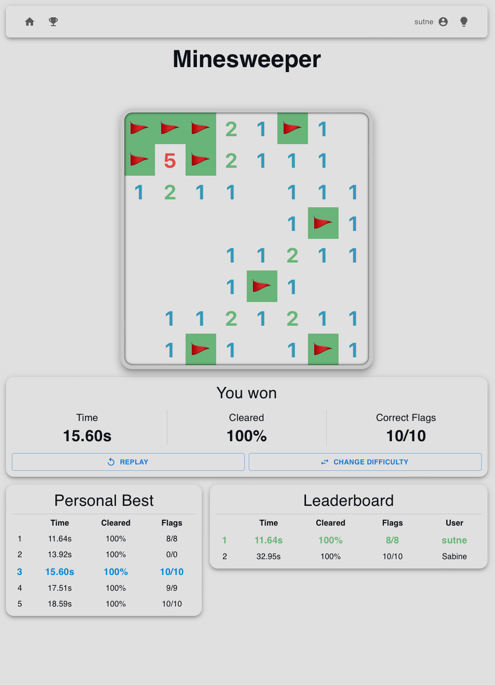
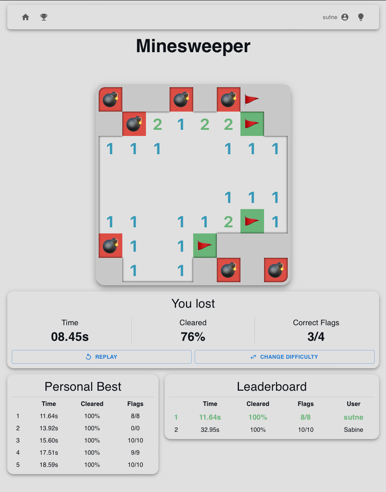
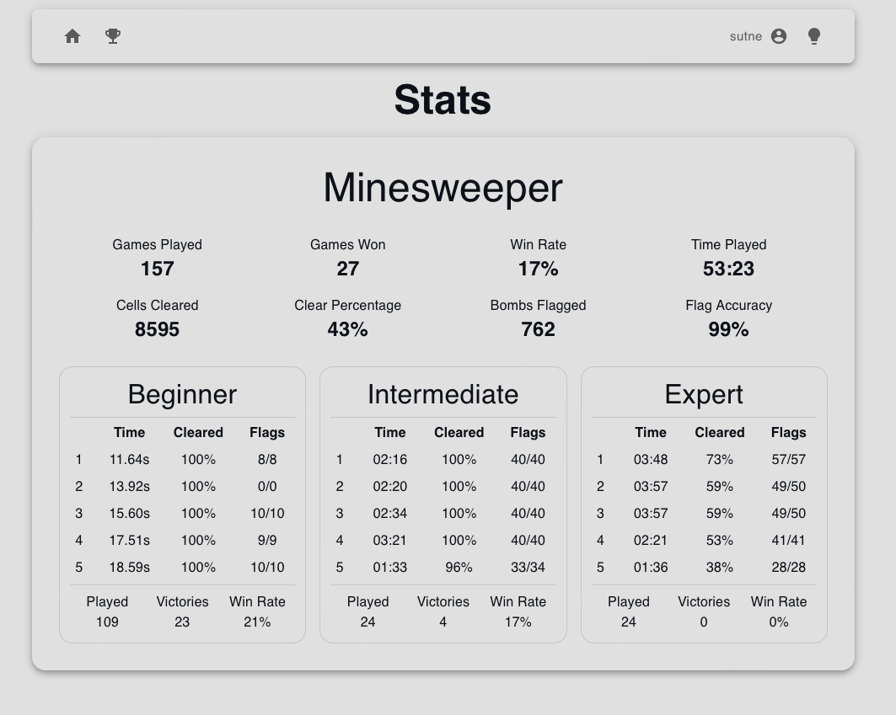

# Minimalistic Games


When im bored i like to have something to tinker with, and i also wanted to be able to have an interactive site without having to set up/run anything.

For this purpose i set up this repo where the idea is that i can add/tweak games using React. Everything is then published to [GitHub Pages](https://sutne.github.io/games). I also wanted some form of backend to keep track of users and their gamestats, and opted to use Firebase Firestore.

## Demo Pictures, but you should [try for yourself](https://sutne.github.io/games)






## Current Bugs/Issues

### Minesweeper

**Entire board (all tiles) re-render on every game update**

Not really a problem on the 'beginner/intermediate' board, but since the tiles are fairly complex, it can get 'laggy' on the 'expert' board.

*Solution: Change so that only tiles that actually change are re-rendered.*


## Setup

> Notes to myself for when i clone the project to continue developing it

### Prerequisites

- [Node.js](https://nodejs.org/en/): `brew install node`


Create the file `.env` in the root of the project and add the following environment variables from the firebase console:
```sh
REACT_APP_FIREBASE_API_KEY=
REACT_APP_FIREBASE_AUTH_DOMAIN=
REACT_APP_FIREBASE_PROJECT_ID=
REACT_APP_FIREBASE_STORAGE_BUCKET=
REACT_APP_FIREBASE_MESSAGE_SENDER_ID=
REACT_APP_FIREBASE_APP_ID=
```

Now simply run the tasks from `.vscode/tasks.json` in VSCode.
